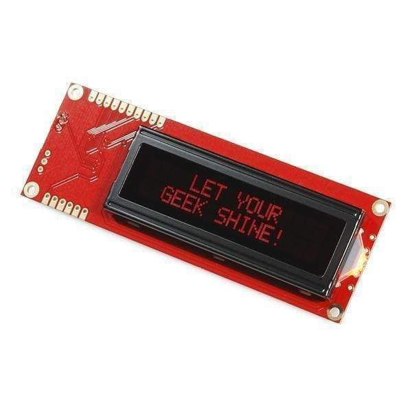

#inputs

##Push-to-make buttons
(use debounce logic and polling on a timer, not enough interrupts)

##Rotary encoders
[Illuminated RGB Quadrature](https://www.sparkfun.com/products/10982)

todo: Fork from Mercurial into git - for now use [QEI](https://os.mbed.com/cookbook/QEI)

mbed add http://os.mbed.com/users/aberk/code/QEI/

#Display
[Red on black 16x2 LCD](https://coolcomponents.co.uk/products/serial-enabled-16x2-lcd-red-on-black-5v?variant=45222877646) - part discontinued.

image:

[Serial LCD Commands](https://learn.sparkfun.com/tutorials/pic-based-serial-enabled-character-lcd-hookup-guide?_ga=2.160322362.623820446.1547752109-968112087.1538925376#firmware-overview)

